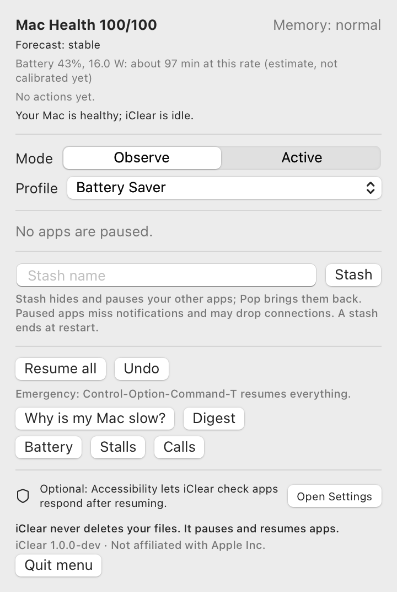

# iClean

iClean pauses idle background apps on a Mac that is running out of memory, and resumes
each one the moment you switch back to it. A paused app keeps its windows, tabs and
unsaved state. It just stops running, so macOS can compress or swap its memory instead
of fighting it for RAM. When memory pressure is normal, iClean does nothing.

**iClean never deletes your files.** The name says "clean", but the behaviour is only
pause, resume and advise. It removes no caches, logs or downloads.

[Oʻzbekcha](README.uz.md) · [How it works](docs/ARCHITECTURE.md) · [Safety](docs/SAFETY.md) ·
[Benchmarks](docs/BENCHMARKS.md) · [FAQ](docs/FAQ.md)

<p align="center"></p>

## When it helps, and when it does not

**Helps:** memory pressure is yellow or red, you have several heavy apps open that you
are not using (browsers, Electron apps, design tools, editors), and those apps keep
waking up in the background.

**Does not help:**

- Memory pressure is green. macOS already handles this well, and iClean stays idle.
- The app using the memory is the one you are working in.
- The memory belongs to something that must keep running (a build, a model, a VM,
  a call). iClean will not pause those.
- Apps that sit idle without waking up. macOS compresses those anyway, frozen or not.
- You are simply short of RAM for the work you do every day. `iclean advise` can tell
  you that once it has a week of data.

## What it does

- **Pause and resume** idle background apps under real pressure: the whole process
  tree, only apps with no visible window, only after every safety check passes.
  Resuming happens first thing when an app is activated.
- **`iclean why`**: "Why is my Mac slow right now?", a ranked, plain-language answer
  from measured data (pressure, swap, top apps, runaway CPU, heat, low disk, Low
  Power Mode).
- **Mac Health score** (0-100, formula in [ARCHITECTURE.md](docs/ARCHITECTURE.md)) in
  the menu bar, with a small swap timeline.
- **Runaway guard**: notices an app spinning the CPU or steadily growing in memory and
  tells you once. It never quits anything on its own.
- **Profiles**: Work, Battery Saver, Presentation and Dev, switching automatically on
  battery, mirroring or screen sharing, or on a schedule.
- **Focus Safe Mode**: no automatic action during calls, screen sharing, mirroring or
  fullscreen use.
- **Observe mode first**: it records what it *would* do until you switch it to Active.
- **Undo, Resume all, and an emergency hotkey** (Control-Option-Command-T). These work
  even if the daemon has crashed.
- **Daily/weekly digest** with measured numbers only, and suggestions such as "this app
  was idle 92% of the time, add it?" or "you reopened this one within a minute three
  times, exclude it?".
- **Explainable**: every action has reason codes; `iclean explain <app>` shows why an
  app was or was not paused.

The signature features, with what was measured for each and what ships on or off, are
in [SIGNATURE_FEATURES.md](docs/SIGNATURE_FEATURES.md): pressure forecast, regret-aware
decisions, habit statistics, connection and write guards, post-resume health check
with quarantine, trace replay (`iclean simulate`), workspaces with staged resume, and a
RAM right-sizing estimate.

## Measured results

From [BENCHMARKS.md](docs/BENCHMARKS.md). Apple M3 Pro, 18 GB, macOS 27.0.1, 2026-09-30.
Synthetic test processes, not real apps. Rows marked (1 run) are single observations.

| What | Result |
|---|---|
| Paused 512 MB process under induced pressure, resident memory | 519 MB → 6 MB (1 run) |
| Identical process that kept running, same pressure | 519 MB → 518 MB (1 run) |
| Resume signal to process running, 1 GB process (p50 / p95) | 0.03 / 0.05 ms |
| Resume with 512 MB to fault back in, under pressure | 80 ms (1 run) |
| Resuming 4 apps one after another: first app usable | 16.7 ms vs 37.7 ms all at once (1 run) |
| Daemon idle CPU (installed, 120 s window) | 0.35% |
| Daemon resident memory | 40 MB |

Not yet measured: memory reclaimed from real apps, real apps' resume latency, energy
savings, Intel Macs, 8 GB Macs.

## Permissions

| Permission | Required? | Used for | If denied |
|---|---|---|---|
| none | | pausing, resuming, `why`, health score, guards | everything works |
| Accessibility | optional | checking that a resumed app responds; measuring resume latency | hangs after resume are not detected; latency shows "not measured" |
| Input Monitoring | optional | experimental predictive resume (off by default) | nothing changes |
| Screen Recording | not used | | |

No root, no kernel extension, no SIP changes, no network access, no telemetry.

## Install

Requires macOS 13 or later, Apple Silicon or Intel.

**Release download.** Get `iClean-1.0.0.zip` (menu-bar app) or
`iclean-1.0.0-macos.tar.gz` (command-line tools) from the
[Releases](https://github.com/urrra39/iClean/releases) page. The builds are ad-hoc
signed, not notarized, so the first launch needs one extra step: right-click the app,
choose Open, then confirm. For the command-line tools, run
`xattr -d com.apple.quarantine iclean icleand ic-hog` after unpacking.

**From source:**

```sh
git clone https://github.com/urrra39/iClean.git && cd iClean
scripts/build-release.sh           # universal binaries, dist/iClean.app
cp -R dist/iClean.app /Applications/
```

**Homebrew:** a formula and a cask template are in `packaging/homebrew/`. They are not
in a public tap yet.

## Quickstart (60 seconds)

```sh
iclean install          # starts the per-user daemon, in Observe mode
iclean status           # what it sees and would do
iclean why              # why is my Mac slow right now?
iclean explain Chrome   # why an app was or was not paused
# ...use your Mac for a day, then:
iclean stats --days 1   # what it would have done, and its would-be regret rate
iclean mode active      # let it act
```

With the app, open iClean from Applications. Its menu shows the same information,
and "Start iClean" installs the daemon. In the app bundle, `iclean` lives in
`iClean.app/Contents/Helpers/`.

Emergency: **Control-Option-Command-T** or `iclean thaw --all` resumes everything.

## Safety model

In short: the freeze journal is written before every pause, and a watchdog process
resumes everything if the daemon dies, even from `kill -9`. Every signal re-checks
PID, start time and owner. A protected set (system, terminals, coding-agent hosts,
password managers, sync, VPN, input and accessibility tools) can never be paused by
any rule. Trees are paused all-or-nothing. Pauses are limited in time (4 h) and total
size (50% of RAM). Apps with audio, calls, downloads, network activity, dev-server
clients, recent writes or lock files are skipped. Each rule has a test; see
[SAFETY.md](docs/SAFETY.md).

## How it compares

These projects solve overlapping problems, and several did so earlier. From reading
their READMEs on 2026-09-30:

| Project | Approach | Difference from iClean |
|---|---|---|
| [ForceNap](https://github.com/omikun/ForceNap) | Suspends apps you pick whenever they lose focus, resumes on focus | Simple and direct. It suspends chosen apps regardless of memory pressure; iClean acts only under pressure and chooses apps itself |
| [Auto Pause Mac Apps](https://github.com/fazalrshah/auto-pause-mac-apps) | Menu-bar app to pause apps and reclaim RAM, plus a "Deep Sleep" that quits with state | Polished manual control and a quit-with-state mode iClean does not have. iClean is automatic, pressure-driven and guard-checked |
| [caproom](https://github.com/intelogroup/caproom) | Memory caps for commands; parks idle process trees with SIGSTOP, escalates to kill over the cap | Built for terminal jobs and agents with hard caps. iClean targets GUI apps and never kills |
| [ProcessX](https://github.com/avantigroupai/ProcessX) | Process/priority monitor; caps CPU by suspending and resuming | Focused on CPU and priority. iClean focuses on memory pressure |
| [GreenRAM](https://github.com/lwj1994/greenram) | Force-quits long-idle background apps over RAM/swap limits | Quitting frees all memory at the cost of state. iClean pauses and keeps state |
| [Canaryd](https://github.com/ThaddeusJiang/canaryd) | Watchdog for stalled services, Simulators, heat, idle memory; asks idle heavy apps to close | Broader developer-machine watchdog. iClean pauses instead of closing |
| [MemoryShield](https://github.com/MaatheusGois/MemoryShield) | Per-process memory history; can auto-kill over a threshold | History and alerts exist there too. iClean does not kill |
| [mac-memory-guard](https://github.com/TomGranot/mac-memory-guard) | Warns before a memory freeze, lets you quit apps one by one | Warning-first and human-in-the-loop. iClean acts on its own |

As of 2026-09-30, we did not find a pressure ETA forecast, regret-aware freezing,
connection/write guards before pausing, a post-resume quarantine or trace replay in
those projects or in our GitHub searches ([NOVELTY.md](docs/NOVELTY.md)). Not finding
something is not proof that it does not exist.

## Tested on

Only one Mac so far: Apple M3 Pro, 18 GB, macOS 27.0.1. iClean adapts its thresholds to
RAM size, disk type and battery, but "adapts to any MacBook" is not "tested on every
MacBook". Run `iclean doctor --report` and add your Mac to
[COMPATIBILITY.md](docs/COMPATIBILITY.md).

## Uninstall

```sh
iclean uninstall --purge   # stops the daemon (resuming everything), removes the
                           # LaunchAgent and deletes ~/Library/Application Support/iClean
rm -rf /Applications/iClean.app
```

## More

[Architecture](docs/ARCHITECTURE.md) · [Safety](docs/SAFETY.md) ·
[Feasibility study](docs/FEASIBILITY.md) · [Decisions](docs/DECISIONS.md) ·
[Trace format](docs/TRACE_FORMAT.md) · [Quality](docs/QUALITY.md) ·
[Contributing](CONTRIBUTING.md) · [Security](SECURITY.md) · [Changelog](CHANGELOG.md)

MIT License. Not affiliated with Apple Inc. macOS and MacBook are trademarks of Apple
Inc. iClean is unrelated to the cache and disk cleaners with similar names
([NAMING.md](docs/NAMING.md)).
