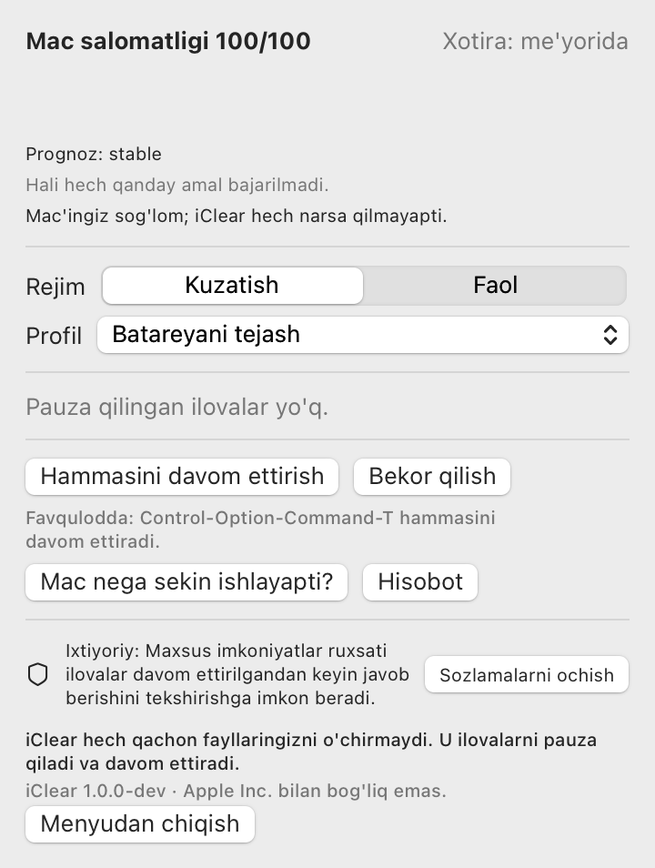

# iClean

iClean xotirasi tugayotgan Mac'da fonda bo'sh turgan ilovalarni pauza qiladi va siz
qaysi biriga qaytsangiz, uni o'sha zahoti davom ettiradi. Pauza qilingan ilova
oynalari, tablari va saqlanmagan holatini saqlab qoladi. U shunchaki ishlashdan
to'xtaydi, shunda macOS u bilan RAM uchun kurashish o'rniga uning xotirasini siqishi
yoki svopga chiqarishi mumkin. Xotira bosimi me'yorida bo'lsa, iClean hech narsa
qilmaydi.

**iClean hech qachon fayllaringizni o'chirmaydi.** Nomida "clean" (tozalash) bor,
lekin u faqat pauza qiladi, davom ettiradi va maslahat beradi. Kesh, log yoki
yuklanmalarni o'chirmaydi.

[English](README.md) · [Qanday ishlaydi](docs/ARCHITECTURE.md) · [Xavfsizlik](docs/SAFETY.md) ·
[O'lchovlar](docs/BENCHMARKS.md) · [Savol-javob](docs/FAQ.md) (hujjatlar ingliz tilida)

<p align="center"></p>

## Qachon yordam beradi va qachon bermaydi

**Yordam beradi:** xotira bosimi sariq yoki qizil, siz ishlatmayotgan bir nechta og'ir
ilova ochiq (brauzerlar, Electron ilovalari, dizayn vositalari, muharrirlar) va ular
fonda tez-tez uyg'onib turadi.

**Yordam bermaydi:**

- Xotira bosimi yashil. macOS buni o'zi yaxshi uddalaydi va iClean hech narsa qilmaydi.
- Xotirani siz hozir ishlayotgan ilova egallagan.
- Xotira to'xtamasligi kerak bo'lgan narsaga tegishli (build, model, virtual mashina,
  qo'ng'iroq). iClean ularni pauza qilmaydi.
- Uyg'onmasdan jim turgan ilovalar. macOS ularni baribir siqadi, muzlatilgan yoki
  muzlatilmaganidan qat'i nazar.
- Kundalik ishingiz uchun RAM shunchaki yetmaydi. Bir haftalik ma'lumot yig'ilgach,
  `iclean advise` buni aytib beradi.

## Nima qiladi

- Haqiqiy bosim ostida bo'sh turgan fon ilovalarini **pauza qiladi va davom
  ettiradi**: butun jarayonlar daraxti, faqat ko'rinadigan oynasi yo'q ilovalar, faqat
  barcha xavfsizlik tekshiruvlaridan o'tgandan keyin. Ilova faollashtirilganda birinchi
  ish uni davom ettirish bo'ladi.
- **`iclean why`**: "Mac nega hozir sekin?" degan savolga o'lchangan ma'lumotlardan
  (bosim, svop, eng katta ilovalar, protsessorni band qilganlar, qizish, kam disk, Low
  Power Mode) tartiblangan, oddiy tildagi javob.
- **Mac salomatligi bahosi** (0-100, formula [ARCHITECTURE.md](docs/ARCHITECTURE.md)
  da) menyu panelida, kichik svop grafigi bilan.
- **Runaway himoyasi**: protsessorni aylantirayotgan yoki xotirada tinmay o'sayotgan
  ilovani payqaydi va bir marta xabar beradi. Hech narsani o'zi yopmaydi.
- **Profillar**: Ish, Batareyani tejash, Taqdimot va Dasturlash. Batareyaga o'tganda,
  ekran ko'zgulanganda yoki ulashilganda, yoki jadval bo'yicha avtomatik almashadi.
- **Fokus xavfsiz rejimi**: qo'ng'iroq, ekran ulashish, ko'zgulash yoki to'liq ekran
  paytida avtomatik amal bajarilmaydi.
- **Avval Kuzatish rejimi**: uni Faol rejimga o'tkazmaguningizcha, iClean faqat nima
  qilgan bo'lardi, shuni yozib boradi.
- **Bekor qilish, Hammasini davom ettirish va favqulodda tugmalar**
  (Control-Option-Command-T). Ular xizmat (daemon) ishdan chiqqan bo'lsa ham ishlaydi.
- **Kunlik/haftalik hisobot**: faqat o'lchangan raqamlar, va "bu ilova vaqtning 92%
  ida bo'sh turdi, qo'shamizmi?" yoki "buni bir daqiqa ichida uch marta qayta
  ochdingiz, chiqarib tashlaymizmi?" kabi takliflar.
- **Tushuntiriladi**: har bir amalning sabab kodlari bor; `iclean explain <ilova>`
  ilova nega pauza qilingani yoki qilinmaganini ko'rsatadi.

Asosiy imkoniyatlar, har biri uchun nima o'lchangani va nimasi yoqilgan yoki
o'chirilgan holda chiqishi [SIGNATURE_FEATURES.md](docs/SIGNATURE_FEATURES.md) da:
bosim prognozi, afsusni hisobga oluvchi qarorlar, odat statistikasi, ulanish va yozish
himoyalari, davom ettirishdan keyingi salomatlik tekshiruvi va karantin, iz (trace)
qayta ijrosi (`iclean simulate`), ish to'plamlari bilan bosqichma-bosqich davom
ettirish, va RAM hajmi bo'yicha taxmin.

## O'lchangan natijalar

[BENCHMARKS.md](docs/BENCHMARKS.md) dan. Apple M3 Pro, 18 GB, macOS 27.0.1,
2026-09-30. Sintetik sinov jarayonlari, haqiqiy ilovalar emas. "(1 marta)" belgili
qatorlar yagona kuzatuvlar.

| Nima | Natija |
|---|---|
| Sun'iy bosim ostida pauza qilingan 512 MB jarayon, rezident xotira | 519 MB → 6 MB (1 marta) |
| Xuddi shunday, lekin ishlashda davom etgan jarayon, bir xil bosim | 519 MB → 518 MB (1 marta) |
| Davom ettirish signalidan jarayon ishlashigacha, 1 GB jarayon (p50 / p95) | 0.03 / 0.05 ms |
| Bosim ostida 512 MB xotirani qaytarib yuklash bilan davom ettirish | 80 ms (1 marta) |
| 4 ilovani ketma-ket davom ettirish: birinchi ilova tayyor | 16.7 ms, hammasi birdan bo'lsa 37.7 ms (1 marta) |
| Xizmatning bo'sh holdagi protsessor sarfi (o'rnatilgan, 120 s oyna) | 0.35% |
| Xizmatning rezident xotirasi | 40 MB |

Hali o'lchanmagan: haqiqiy ilovalardan qaytarib olingan xotira, haqiqiy ilovalarning
davom etish kechikishi, energiya tejash, Intel Mac'lar, 8 GB Mac'lar.

## Ruxsatlar

| Ruxsat | Majburiymi? | Nima uchun | Rad etilsa |
|---|---|---|---|
| hech qanday | | pauza, davom ettirish, `why`, salomatlik bahosi, himoyalar | hammasi ishlaydi |
| Maxsus imkoniyatlar (Accessibility) | ixtiyoriy | davom ettirilgan ilova javob berishini tekshirish; kechikishni o'lchash | davom ettirishdan keyingi qotib qolish aniqlanmaydi; kechikish "o'lchanmagan" bo'ladi |
| Kiritishni kuzatish (Input Monitoring) | ixtiyoriy | tajribaviy oldindan davom ettirish (o'chirilgan) | hech narsa o'zgarmaydi |
| Ekranni yozib olish | ishlatilmaydi | | |

Root kerak emas, yadro kengaytmasi yo'q, SIP o'zgartirilmaydi, tarmoqqa ulanmaydi,
telemetriya yo'q.

## O'rnatish

macOS 13 yoki undan yangisi, Apple Silicon yoki Intel kerak.

**Manba koddan** (hozircha yagona yo'l):

```sh
git clone https://github.com/urrra39/iClean.git && cd iClean
scripts/build-release.sh           # universal ikkilik fayllar, dist/iClean.app
cp -R dist/iClean.app /Applications/
```

Build ad-hoc imzolangan, notarizatsiyadan o'tmagan. Agar macOS birinchi ishga
tushirishni to'xtatsa, ilovani o'ng tugma bilan bosing, Open ni tanlang va
tasdiqlang. Buyruq qatori vositalari `dist/iclean-1.0.0/` da va ilova ichida
`iClean.app/Contents/Helpers/` da.

Tayyor relizlar va Homebrew rejalashtirilgan, lekin hali chiqarilmagan.
Formula va cask shablonlari [`packaging/homebrew/`](packaging/homebrew/) da.

## Tez boshlash (60 soniya)

```sh
iclean install          # foydalanuvchi xizmatini Kuzatish rejimida ishga tushiradi
iclean status           # u nimani ko'rmoqda va nima qilgan bo'lardi
iclean why              # Mac nega hozir sekin?
iclean explain Chrome   # ilova nega pauza qilindi yoki qilinmadi
# ...Mac'ingizdan bir kun foydalaning, keyin:
iclean stats --days 1   # u nima qilgan bo'lardi va taxminiy afsus darajasi
iclean mode active      # unga amal qilishga ruxsat bering
```

Ilova bilan: iClean ni Applications dan oching. Menyuda xuddi shu ma'lumotlar bor,
"iClean'ni ishga tushirish" esa xizmatni o'rnatadi.

Favqulodda holat: **Control-Option-Command-T** yoki `iclean thaw --all` hammasini
davom ettiradi.

## Xavfsizlik modeli

Qisqacha: har bir pauzadan oldin muzlatish jurnali yoziladi, va xizmat ishdan chiqsa
(hatto `kill -9` bilan ham), alohida kuzatuvchi (watchdog) jarayon hammasini davom
ettiradi. Har bir signal oldidan PID, boshlanish vaqti va egasi qayta tekshiriladi.
Himoyalangan to'plamni (tizim, terminallar, AI dasturlash agentlari, parol
menejerlari, sinxronlash, VPN, kiritish va maxsus imkoniyat vositalari) hech qanday
qoida bilan pauza qilib bo'lmaydi. Daraxtlar "hammasi yoki hech biri" tamoyili bilan
pauza qilinadi. Pauza vaqti (4 soat) va umumiy hajmi (RAM ning 50%) cheklangan. Audio,
qo'ng'iroq, yuklab olish, tarmoq faolligi, dev-server mijozlari, yaqinda yozilgan
fayllar yoki lock fayllari bo'lgan ilovalar o'tkazib yuboriladi. Har bir qoidaning
testi bor; [SAFETY.md](docs/SAFETY.md) ga qarang.

## Boshqalar bilan taqqoslash

Bu loyihalar o'xshash muammolarni hal qiladi va ularning bir nechtasi buni ilgariroq
qilgan. 2026-09-30 sanasida ularning README fayllarini o'qib chiqildi:

| Loyiha | Yondashuv | iClean dan farqi |
|---|---|---|
| [ForceNap](https://github.com/omikun/ForceNap) | Siz tanlagan ilovalarni fokusdan chiqqanda to'xtatadi, fokusga qaytganda davom ettiradi | Oddiy va to'g'ridan-to'g'ri. U tanlangan ilovalarni xotira bosimidan qat'i nazar to'xtatadi; iClean faqat bosim ostida harakat qiladi va ilovalarni o'zi tanlaydi |
| [Auto Pause Mac Apps](https://github.com/fazalrshah/auto-pause-mac-apps) | Ilovalarni pauza qilib RAM ni qaytarish uchun menyu ilovasi, holatni saqlab yopadigan "Deep Sleep" rejimi bilan | Qo'lda boshqarish qulay va iClean da yo'q holatni saqlab yopish rejimi bor. iClean avtomatik, bosimga asoslangan va himoyalar bilan tekshiriladi |
| [caproom](https://github.com/intelogroup/caproom) | Buyruqlar uchun xotira chegarasi; bo'sh jarayon daraxtlarini SIGSTOP bilan "to'xtatib qo'yadi", chegaradan oshsa o'chiradi | Terminal ishlari va agentlar uchun qat'iy chegaralar bilan qurilgan. iClean GUI ilovalarni nishonga oladi va hech qachon o'chirmaydi |
| [ProcessX](https://github.com/avantigroupai/ProcessX) | Jarayon/ustuvorlik monitori; protsessorni to'xtatib-davom ettirish orqali cheklaydi | Protsessor va ustuvorlikka qaratilgan. iClean xotira bosimiga qaratilgan |
| [GreenRAM](https://github.com/lwj1994/greenram) | RAM/svop chegarasidan oshganda uzoq bo'sh turgan fon ilovalarini majburan yopadi | Yopish barcha xotirani bo'shatadi, lekin holat yo'qoladi. iClean pauza qiladi va holatni saqlaydi |
| [Canaryd](https://github.com/ThaddeusJiang/canaryd) | To'xtab qolgan xizmatlar, Simulator, qizish va bo'sh xotira uchun kuzatuvchi; bo'sh og'ir ilovalardan yopilishni so'raydi | Dasturchi kompyuteri uchun kengroq kuzatuvchi. iClean yopish o'rniga pauza qiladi |
| [MemoryShield](https://github.com/MaatheusGois/MemoryShield) | Har bir jarayon xotira tarixi; chegaradan oshganda avtomatik o'chira oladi | Tarix va ogohlantirishlar u yerda ham bor. iClean o'chirmaydi |
| [mac-memory-guard](https://github.com/TomGranot/mac-memory-guard) | Xotira tufayli qotishdan oldin ogohlantiradi va ilovalarni birma-bir yopishga imkon beradi | Avval ogohlantiradi, qarorni inson qiladi. iClean o'zi harakat qiladi |

2026-09-30 holatiga ko'ra, biz bosim uchun ETA prognozi, afsusni hisobga oluvchi
muzlatish, pauzadan oldingi ulanish/yozish himoyalari, davom ettirishdan keyingi
karantin yoki iz qayta ijrosini bu loyihalarda ham, GitHub qidiruvlarimizda ham
topmadik ([NOVELTY.md](docs/NOVELTY.md)). Topilmagani mavjud emasligini isbotlamaydi.

## Qayerda sinalgan

Hozircha faqat bitta Mac'da: Apple M3 Pro, 18 GB, macOS 27.0.1. iClean chegaralarini
RAM hajmi, disk turi va batareyaga moslaydi, lekin "har qanday MacBook'ga moslashadi"
degani "har bir MacBook'da sinalgan" degani emas. `iclean doctor --report` ni ishga
tushiring va Mac'ingizni [COMPATIBILITY.md](docs/COMPATIBILITY.md) ga qo'shing.

## O'chirib tashlash

```sh
iclean uninstall --purge   # xizmatni to'xtatadi (hammasini davom ettiradi), LaunchAgent ni
                           # olib tashlaydi va ~/Library/Application Support/iClean ni o'chiradi
rm -rf /Applications/iClean.app
```

## Batafsil

[Arxitektura](docs/ARCHITECTURE.md) · [Xavfsizlik](docs/SAFETY.md) ·
[Imkoniyatlarni o'rganish](docs/FEASIBILITY.md) · [Qarorlar](docs/DECISIONS.md) ·
[Iz formati](docs/TRACE_FORMAT.md) · [Hissa qo'shish](CONTRIBUTING.md) ·
[Xavfsizlik siyosati](SECURITY.md) · [O'zgarishlar](CHANGELOG.md)

MIT litsenziyasi. Apple Inc. bilan bog'liq emas. macOS va MacBook Apple Inc.ning
savdo belgilaridir. iClean shunga o'xshash nomli kesh va disk tozalagichlar bilan
bog'liq emas ([NAMING.md](docs/NAMING.md)).
